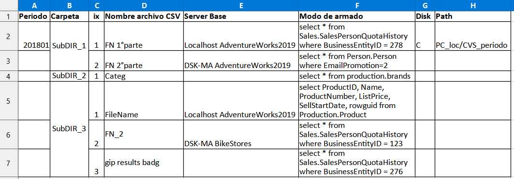

# Queries_a_CSVs - qacsv.py
- Escribe queries a Bases de Datos en archivos .CSV.

En la Compañía en la que trabajo, surgió la necesidad de generar varios archivos .CSV 
(Comma Separated Values), a partir de datos de salida de diferentes queries a distintas
 BDs.
Estos CSVs deben ser guardados en directorios específicos del disco local C: (en un
sistema Windows), y sirven como entrada para un proceso de análisis de datos.
Dado que en la Compañía los usuarios manejan habitualmente archivos .xlsx yo
propuse que en un planilla de cálculo se generara la lista de todos los .CSV requeridos
junto con toda la información adicional necesaria para construir y almacenar dichos 
.CSV de salida.
Esta planilla de cálculo, cuyo nombre de archivo debe ser CSVs_list.xlsx, oficiará de
archivo de entrada del script qacsv.py, y debe tener el siquiente formato:

qacsv.py lo que hace es leer listas/CSVs_list.xlsx y completar los queries y 
tareas indicadas en cada sus filas.

Escribí dos versiones de qacsv.py. La procedimental (o funcional) y la OOP.
....

Definiciones:
- Archivo de Entrada: listas/CSVs_list.xlsx (camino relativo respecto de qacsv.py)
- Archivo de Logs: logs/qacsv_AAAAMMDDHHmm.log

- Format of Input file as show above, with this considerations:
	- Can add all the columns they want
	- Columns readed: ['Periodo', 'Carpeta', 'Nombre de archivo CSV', 'Server Base', 'Modo de armado', 'Disk', 'path']
	- The order of the columns does not matter, but the name must be that of the example.
	- ffill ['Server Base','Disk', 'path'] columns.
- Period value is only readed from df.loc[0, 'Periodo']
- If exist a csv with the same name rewrite it.
- Is important to move or rename CSV_list.xlsx cause next run could damage csvs early created.
	1. If no error occurs CSV_list.xlsx is move to listas_hechas/CSV_list_AAAAMMDDHHmm.xlsx (of course same AAAAMMDDHHmm as Log file)
	2. if any error occurs rename CSV_list.xlsx to CSV_list_AAAAMMDDHHmm_err.xlsx in the same dir
- Log the list of server-db connections failures, plus errors, plus successful cnxs.
- For csv of successful connections log a list of errors, list of not generated csvs, and list of successfully created csvs.
- Show a summary of the resultas at the end of the process

TO-DO:
- List generated files and subdirectories in kind of tree view (minor)
- List csv files that couldn't be processed cause server-db connection fail
- Make a super class of DBconextion for several DB engines (MySQL, SQLite, Postgress...)
	- and the a subclass for every diff. engine
- Make a unic class of whole app, kind of CSV_list class that containd all methods
- Make static typed codfication (permit mypy check)
	- https://mypy.readthedocs.io/en/stable/getting_started.html#installing-and-running-mypy
- (Nice Pandas excersice), at the end of the process, ADD a column to the CSV_list.xlsx named 'DONE'
	- DONE col.: values 'ok' for succesfuly build files and 'NO' for those files that couldn't be generated
	- Rename this file like CSV_list_AAAAMMDDHHmm_done_err.xlsx if errors occurs or CSV...HHmm_done.xlsx if not
	- PLUS other col named 'ERROR' for those NO generated files rows
	- PLUS..

And I was going to generate a script in python that read that .xlsx, 
called CSVs_list.xlsx, and complete the queries and writings to csv indicated there.

I built the solution in two different versions. The procedural version and the OOP.
The OOP version is more complete in terms of summary of results.
Both versions are premised on processing all the tasks indicated in the input .xlsx, 
and not stop for mistakes, just record them for each case.
The results of the process are recorded in the same way on the screen as in the log file.

Definitions:
- Input file: listas/CSVs_list.xlsx (relative path from qacsv.py)
- Log file: logs/qacsv_AAAAMMDDHHmm.log 
- Format of Input file as show above, with this considerations:
	- Can add all the columns they want
	- Columns readed: ['Periodo', 'Carpeta', 'Nombre de archivo CSV', 'Server Base', 'Modo de armado', 'Disk', 'path']
	- The order of the columns does not matter, but the name must be that of the example.
	- ffill ['Server Base','Disk', 'path'] columns.
- Period value is only readed from df.loc[0, 'Periodo']
- If exist a csv with the same name rewrite it.
- Is important to move or rename CSV_list.xlsx cause next run could damage csvs early created.
	1. If no error occurs CSV_list.xlsx is move to listas_hechas/CSV_list_AAAAMMDDHHmm.xlsx (of course same AAAAMMDDHHmm as Log file)
	2. if any error occurs rename CSV_list.xlsx to CSV_list_AAAAMMDDHHmm_err.xlsx in the same dir
- Log the list of server-db connections failures, plus errors, plus successful cnxs.
- For csv of successful connections log a list of errors, list of not generated csvs, and list of successfully created csvs.
- Show a summary of the resultas at the end of the process

TO-DO:
- List generated files and subdirectories in kind of tree view (minor)
- List csv files that couldn't be processed cause server-db connection fail
- Make a super class of DBconextion for several DB engines (MySQL, SQLite, Postgress...)
	- and the a subclass for every diff. engine
- Make a unic class of whole app, kind of CSV_list class that containd all methods
- Make static typed codfication (permit mypy check)
	- https://mypy.readthedocs.io/en/stable/getting_started.html#installing-and-running-mypy
- (Nice Pandas excersice), at the end of the process, ADD a column to the CSV_list.xlsx named 'DONE'
	- DONE col.: values 'ok' for succesfuly build files and 'NO' for those files that couldn't be generated
	- Rename this file like CSV_list_AAAAMMDDHHmm_done_err.xlsx if errors occurs or CSV...HHmm_done.xlsx if not
	- PLUS other col named 'ERROR' for those NO generated files rows
	- PLUS..

